# FlowWallet — Design & Frontend Summary
> **Purpose:** Reference document for PPT creation, design reviews, and feature planning.  
> **App as of:** March 24, 2026 · React 19 + Vite + TailwindCSS · Backend: Node.js + PostgreSQL (localhost:5000)

---

## 1. What the App Does

**FlowWallet** is a **personal finance management app for Indian users**. Its core tagline is *"Your money, one flow."*

It connects to Indian bank accounts and credit cards via a simulated **Account Aggregator (AA)** consent flow, displays a unified financial dashboard, tracks budgets by category, manages savings goals, and provides an **AI financial assistant ("FinWise AI")** that can answer questions and perform actions like adding transactions or creating goals.

### Core Value Propositions
| Feature | Description |
|---|---|
| **Unified Net Worth** | Aggregates all bank accounts + card balances in one view |
| **Budget Tracker** | Category-wise spending vs. budget with progress bars |
| **Goals** | Savings goals with AI-powered advice (FinWise Goal Advisor) |
| **AI Assistant (FinWise AI)** | Conversational AI that can read and write financial data |
| **Manual Entry** | Add cash transactions manually |
| **Expenses / Transactions** | Browse all historical transactions |
| **Account Balance** | Per-account breakdown |

---

## 2. Tech Stack

| Layer | Technology |
|---|---|
| Frontend Framework | React 19 + Vite 8 |
| Styling | TailwindCSS 3 (utility-first) |
| Icons | Lucide React |
| Charts | Chart.js + react-chartjs-2 |
| Routing | React Router DOM v7 |
| State | Local component state + localStorage |
| Backend | Node.js (Express), PostgreSQL |
| AI | External AI API (chat.js / z.ai.py) |

---

## 3. App Architecture & Navigation

### Route Structure

```
/ (Splash)
├── /onboarding/login        → Phone number entry + test user picker
├── /onboarding/otp-consent  → Mock OTP + Account Aggregator consent
├── /onboarding/banks        → Select linked banks (Step 3 of 4)
├── /onboarding/cards        → Select linked cards (Step 4 of 4)
└── /app/*                   → Main App Shell (requires localStorage session)
    ├── /app/home            → Home Dashboard (default)
    ├── /app/budget          → Budget tracker
    ├── /app/goals           → Goals tracker + FinWise AI advisor
    ├── /app/ai              → FinWise AI chat
    ├── /app/profile         → User profile & linked accounts
    ├── /app/account-balance → Account balance detail
    ├── /app/expenses        → Expense breakdown
    ├── /app/transactions    → Full transaction history
    ├── /app/manual-entry    → Manual transaction entry form
    └── /app/goals-planner   → Goals planner (legacy)
```

### Navigation Components
- **Mobile (< lg):** Fixed bottom tab bar — Home, Budget, Goals, AI, Profile
- **Desktop (≥ lg):** Left sidebar rail with grouped links (Core / Pages / Account)
- **Global:** Floating teal AI assistant button (bottom-right, visible on all screens)
- **Top strip:** Backend connection status banner (shows "Connected / Disconnected")

---

## 4. Design System

### 4.1 Color Palette

| Role | Color | Usage |
|---|---|---|
| **Primary / Brand** | Teal-500 → Cyan-500 gradient | CTA buttons, active nav, progress bars, AI widget |
| **Dark Hero** | Slate-900 (`#0f172a`) | Net Worth card, dark CTAs, sidebar brand |
| **Neutral Surface** | Slate-50 (`#f8fafc`) | Page backgrounds |
| **Card Surface** | White + `ring-1 ring-slate-200` | All cards and panels |
| **Income / Positive** | Emerald-700 (`#047857`) | Positive amounts, credit transactions |
| **Expense / Negative** | Rose-600/700 (`#e11d48`) | Debit amounts, expenses |
| **Label / Muted** | Slate-500 | Secondary labels, metadata |
| **Warning / Suggestion** | Amber-700 / Amber-100 | Popup alerts, inline warnings |

### 4.2 Typography

- **Font:** System default (no custom Google Font imported — opportunity to add Inter/Outfit)
- **Scale:**
  - App name / hero numbers: `text-2xl–3xl font-black tracking-tight`
  - Section headings: `text-xl font-black`
  - Card titles: `text-sm font-bold`
  - Labels / metadata: `text-xs uppercase tracking-wide` (slate-500)
  - Body: `text-sm` (slate-700/800)

### 4.3 Spacing & Layout

- **Max width:** `max-w-md` (448px) for mobile content, `max-w-7xl` for desktop
- **Grid desktop:** `grid lg:grid-cols-[260px_1fr]` — sidebar + main content
- **Card padding:** `p-3` (small), `p-4` (standard), `p-5–p-6` (hero cards)
- **Card radius:** `rounded-xl` (standard), `rounded-2xl` (large), `rounded-3xl` (hero)

### 4.4 Component Patterns

| Component | Description |
|---|---|
| **Net Worth Hero Card** | Dark slate-900, white text, full-width `rounded-2xl` |
| **Stat Pair Cards** | `grid grid-cols-2 gap-3`, white bg, ring border |
| **List Item Cards** | White bg, `ring-1 ring-slate-200`, `rounded-xl`, `p-3` |
| **Progress Bar** | `h-2 rounded-full bg-slate-200` + teal-to-cyan gradient fill |
| **Dark CTA Button** | `rounded-2xl bg-slate-900 py-3 text-sm font-bold text-white` |
| **Secondary Button** | `rounded-2xl border border-dashed border-slate-300` |
| **Back Button** | `rounded-full border border-teal-200 bg-white text-teal-700 text-xs` |
| **Toggle Pill** | `inline-flex rounded-xl bg-slate-100 p-1`, active = white bg |
| **Floating AI FAB** | `h-12 w-12 rounded-2xl bg-gradient teal-to-cyan`, fixed bottom-right |
| **AI Dark Panel** | `rounded-2xl bg-slate-900` with teal icon + suggestion chip grid |

---

## 5. Screen-by-Screen Breakdown

### 5.1 Splash Screen
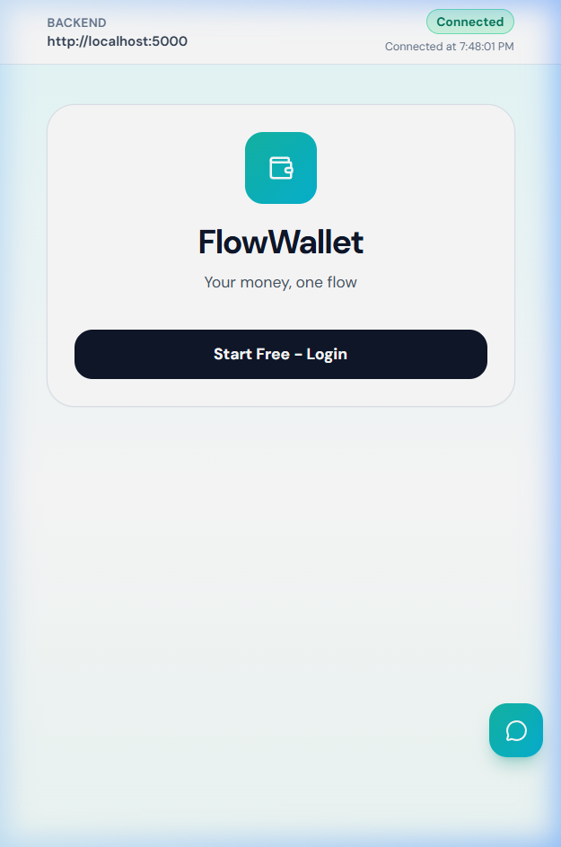

**Route:** `/`  
**Layout:** Centered white card on a cyan-50 → white → teal-50 gradient background  
**Elements:** Teal wallet icon, "FlowWallet" heading, tagline, single dark CTA "Start Free - Login"  
**Purpose:** Brand first impression + single clear action

---

### 5.2 Login Page
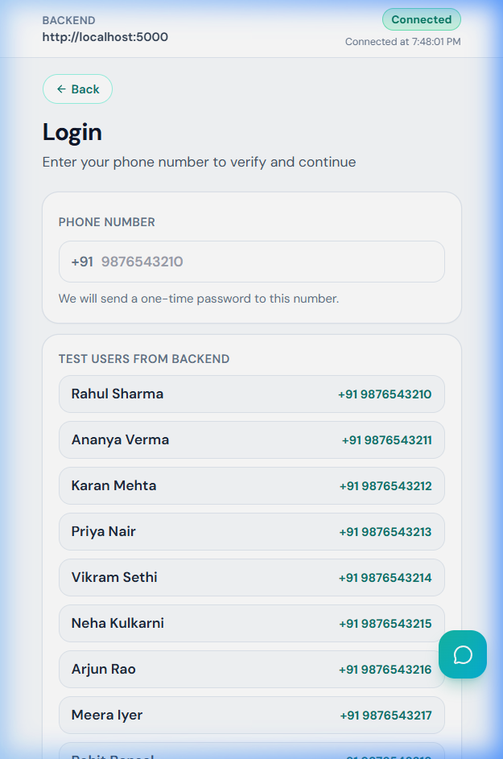

**Route:** `/onboarding/login`  
**Layout:** White card with phone input + demo user list loaded from backend  
**UX:** Click demo user → auto-fills phone number (zero manual typing)  
**Backend:** `GET /users` → auto-seeds demo data on first load

---

### 5.3 OTP & Account Aggregator Consent
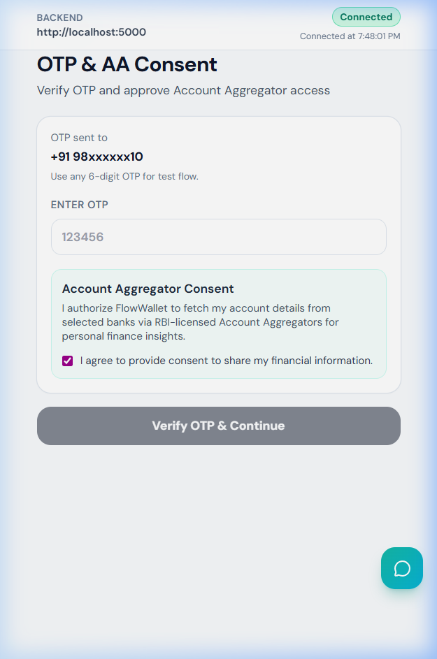

**Route:** `/onboarding/otp-consent`  
**Elements:** Masked phone display, 6-digit OTP field, teal-tinted AA consent checkbox  
**Mock behavior:** Any 6-digit code works — it's a demo  
**UX note:** Consent pre-checked → minimal friction

---

### 5.4 Onboarding — Bank Selection (Step 3/4)
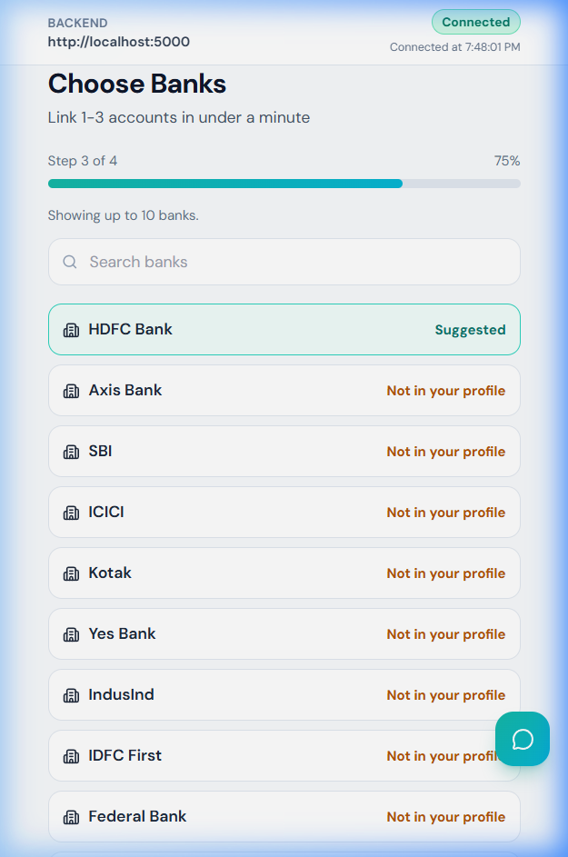

**Route:** `/onboarding/banks`  
**Layout:** Search bar + scrollable bank list  
**Behavior:** Backend-suggested banks labeled "Suggested" (teal); others labeled "Not in your profile" (amber)  
**Progress:** 4-step progress bar at top (75%)

---

### 5.5 Onboarding — Card Selection (Step 4/4)
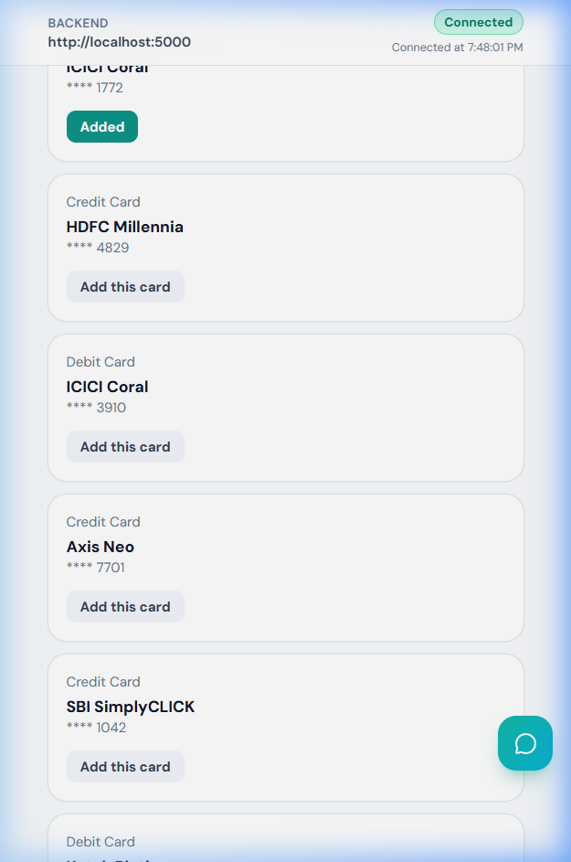

**Route:** `/onboarding/cards`  
**Layout:** Card article list — type, name, last-4 digits, toggle button  
**CTA:** "Go to Dashboard" → saves snapshot to localStorage → navigates to `/app/home`

---

### 5.6 App Home Dashboard
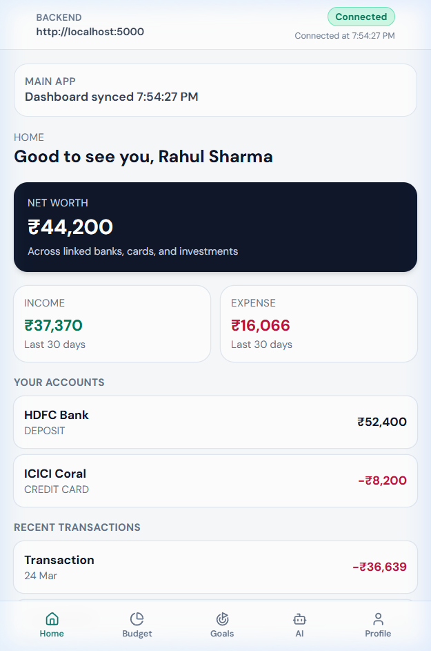

**Route:** `/app/home`  
**Sections (top to bottom):**
1. Greeting: *"Good to see you, [Name]"*
2. **Net Worth** hero card (dark, ₹44,200)
3. Income vs Expense 2-column cards (last 30 days)
4. **Your Accounts** list (HDFC Bank, ICICI Coral credit card)
5. **Recent Transactions** (5 most recent)
6. **Quick Actions** grid: Transfer · Search · Add · More

---

### 5.7 Budget Tab
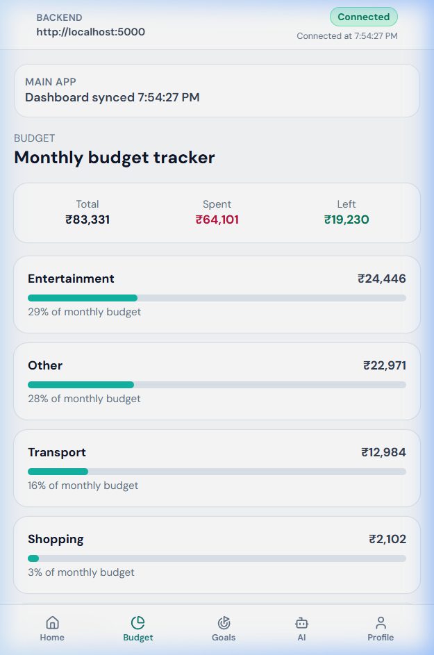

**Route:** `/app/budget`  
**Title:** "Monthly budget tracker"  
**Stats header:** Total ₹83,331 · Spent ₹64,101 · Left ₹19,230  
**Categories with progress bars:** Entertainment (29%), Other (28%), Transport (16%), Shopping (3%)

---

### 5.8 Goals Tab
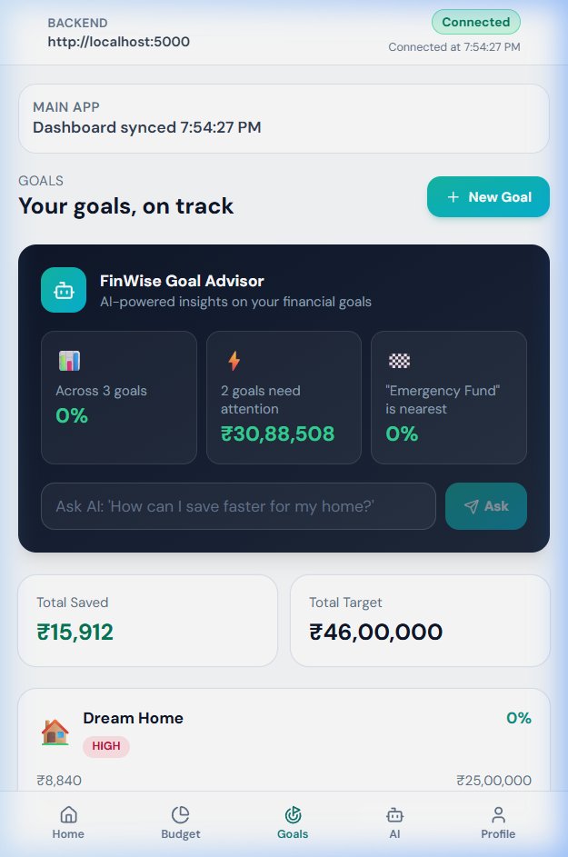

**Route:** `/app/goals`  
**FinWise Goal Advisor panel:** Dark card showing 3 stats + AI text input for goal advice  
**Summary:** Total Saved ₹15,912 · Total Target ₹46,00,000  
**Goal cards:** "Dream Home" (HIGH priority, 0%, ₹8,840 / ₹25,00,000)  
**CTA:** "+ New Goal" button (top-right)

---

### 5.9 AI Tab — FinWise AI
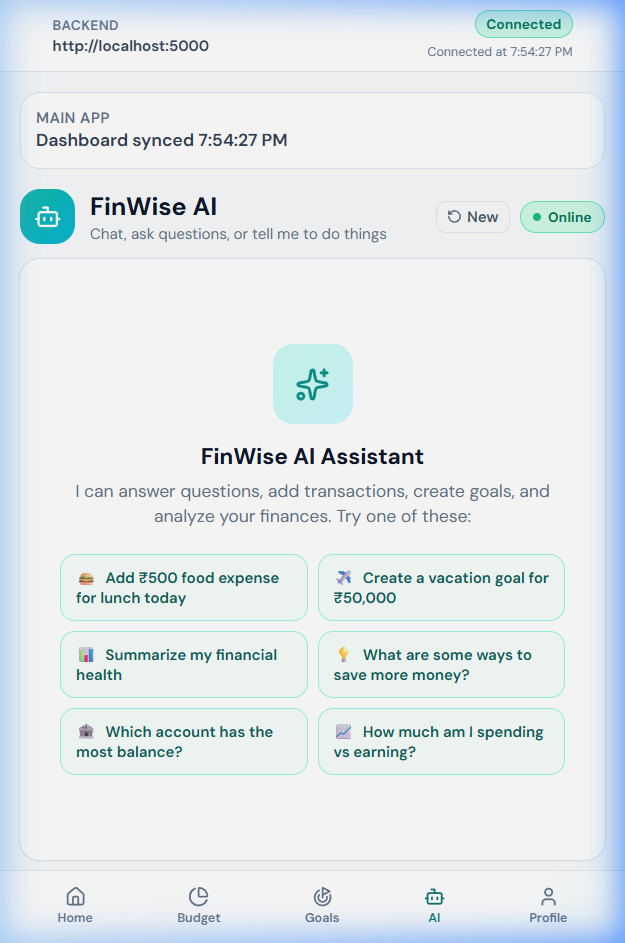

**Route:** `/app/ai`  
**Header:** Bot avatar + "FinWise AI" + Online badge + "New" reset  
**Empty state:** 6 example prompt chips in 2×3 grid:
- Add ₹500 food expense for lunch today
- Create a vacation goal for ₹50,000
- Summarize my financial health
- What are some ways to save more money?
- Which account has the most balance?
- How much am I spending vs earning?

---

### 5.10 Profile Tab
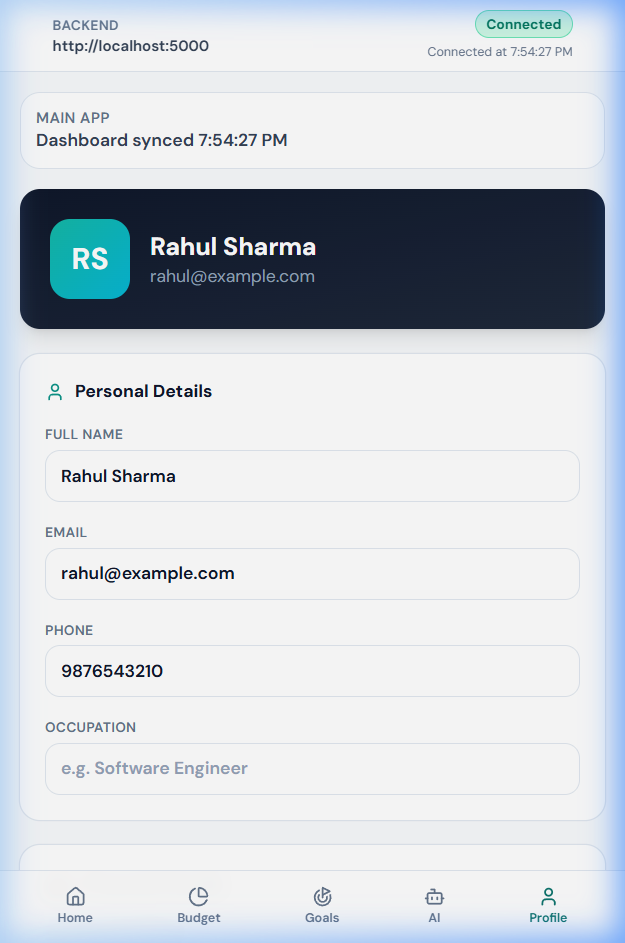

**Route:** `/app/profile`  
**Header:** Dark card with initials avatar (teal bg), name, email  
**Form fields:** Full Name, Email, Phone, Occupation  
**Linked accounts:** Shown below the form (banks + cards from onboarding)

---

### 5.11 Account Balance Page
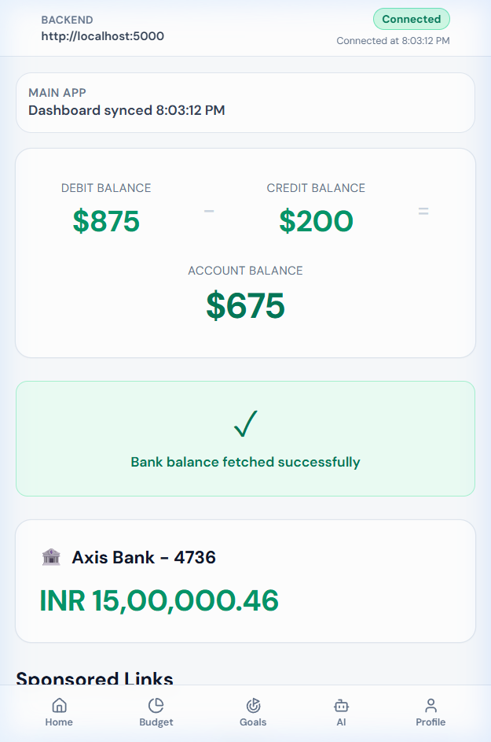

**Route:** `/app/account-balance`  
**Purpose:** Per-account balance breakdown — deposit accounts + credit card outstanding

---

### 5.12 Expenses Page
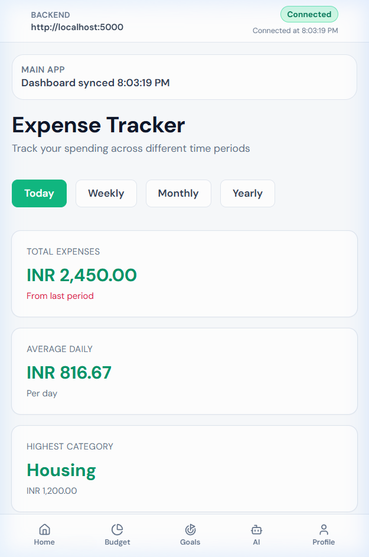

**Route:** `/app/expenses`  
**Purpose:** Category-wise expense breakdown with Chart.js visualizations

---

### 5.13 Manual Entry Page
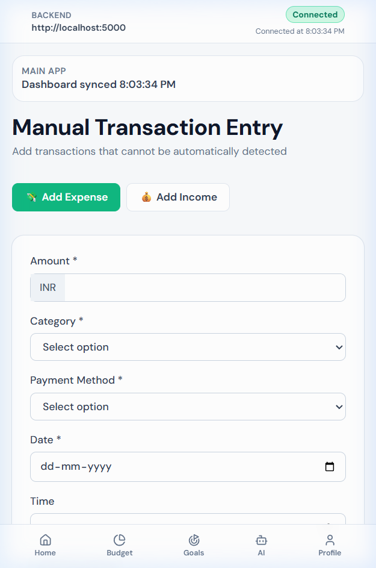

**Route:** `/app/manual-entry`  
**Purpose:** Form to log cash/manual transactions  
**Stores to:** `localStorage` key `fw_transactions` and fires `fw-data-changed` event (HomeTab listens)

---

### 5.14 Transactions Page
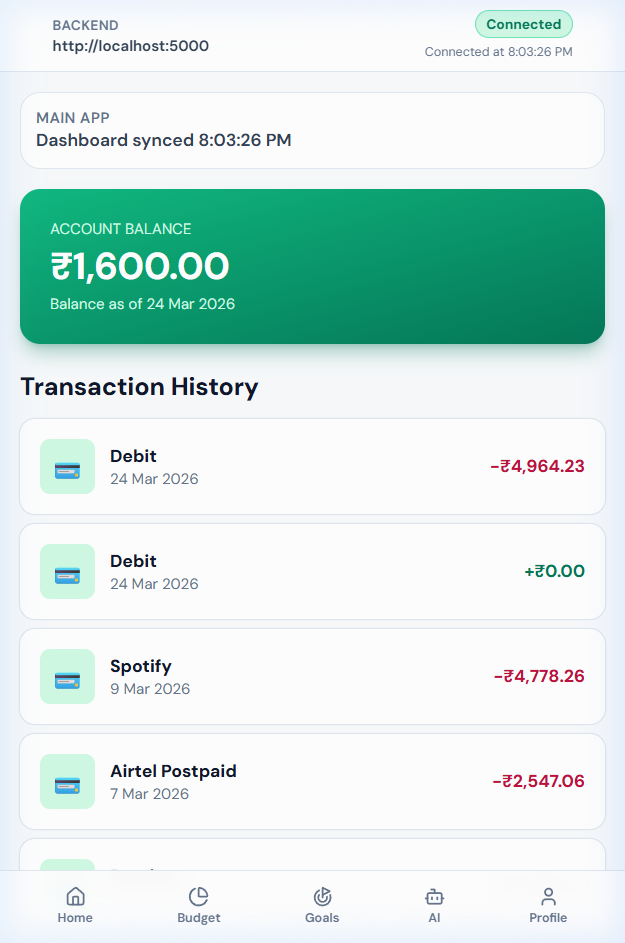

**Route:** `/app/transactions`  
**Purpose:** Full chronological list of all transactions (backend + manual entries merged and sorted)

---

## 6. UX Flow Summary

```
Splash → Login (pick demo user) → OTP (any 6 digits) → Banks → Cards → App Home
                                                                          ↕
                                                         Bottom Nav: Home | Budget | Goals | AI | Profile
                                                                          ↕
                                                         Deep pages: Account Balance · Expenses · Transactions
                                                                     Manual Entry · Taxes · Goals Planner
```

**Session persistence:** Stored in `localStorage` key `flowwallet.onboarding.profile` as JSON snapshot.  
**Backend sync:** On app load, fetches dashboard context via `GET /dashboard-context/:userId`.

---

## 7. Design Strengths

- ✅ Clean, modern card-based layout — easy to scan
- ✅ Consistent color language — teal=brand, rose=expense, emerald=income
- ✅ Mobile-first — designed for 390–500px, degrades gracefully to desktop
- ✅ AI deeply integrated — not just a chatbot but embedded in Goals and accessible everywhere
- ✅ Low-friction onboarding — demo users, any OTP, suggested banks/cards pre-selected
- ✅ Responsive nav — bottom tabs on mobile, sidebar rail on desktop

---

## 8. Design Gaps & Opportunities

| Area | Current State | Opportunity |
|---|---|---|
| **Typography** | System default fonts | Add Inter/Outfit from Google Fonts for premium feel |
| **Splash/Landing** | Minimal — logo + one button | Add feature highlights, screenshots, value props |
| **Dark Mode** | Not implemented | Add dark mode toggle |
| **Charts** | Basic progress bars in Budget | Donut charts, line trends in Expenses/Budget |
| **Transactions** | Plain list | Add filter/search, category icons, date grouping |
| **Goals** | Progress only | Add visual milestone timeline, confetti on 100% |
| **Animations** | None | Page transitions, loading skeletons, micro-animations |
| **Error States** | Basic text messages | Illustrated empty/error states |
| **Notifications** | Absent | Budget alerts, goal milestone push nudges |
| **Color Depth** | Mostly white/slate | More gradient use, accent backgrounds per section |

---

## 9. File Structure Reference

```
web/frontend/src/
├── flowwallet/
│   ├── setup.jsx              ← Onboarding + login flow (Splash, Login, OTP, Banks, Cards)
│   ├── FlowWalletApp.jsx      ← Legacy v1 routes (/north, /tasks, /transfer, etc.)
│   └── mainApp/
│       ├── MainAppShell.jsx   ← App shell — sidebar + bottom nav + data loading
│       ├── MainAppSkeleton.jsx
│       └── tabs/
│           ├── HomeTab.jsx    ← /app/home
│           ├── BudgetTab.jsx  ← /app/budget
│           ├── GoalsTab.jsx   ← /app/goals
│           ├── AiTab.jsx      ← /app/ai
│           └── ProfileTab.jsx ← /app/profile
├── pages/                     ← Legacy full-page components
│   ├── AccountBalance.jsx
│   ├── Expenses.jsx
│   ├── Goals.jsx
│   ├── ManualEntry.jsx
│   └── Transactions.jsx
├── services/
│   └── backendApi.js          ← All API calls to localhost:5000
└── components/
    ├── Navbar.jsx, Sidebar.jsx
    ├── ChartWrapper.jsx
    └── QuickActions.jsx
```

---

*Generated: March 24, 2026 — FlowWallet v0.0.0*
